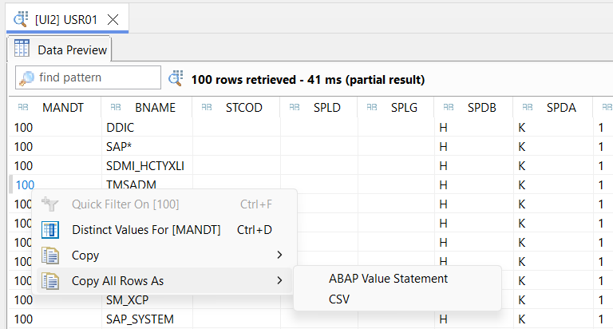
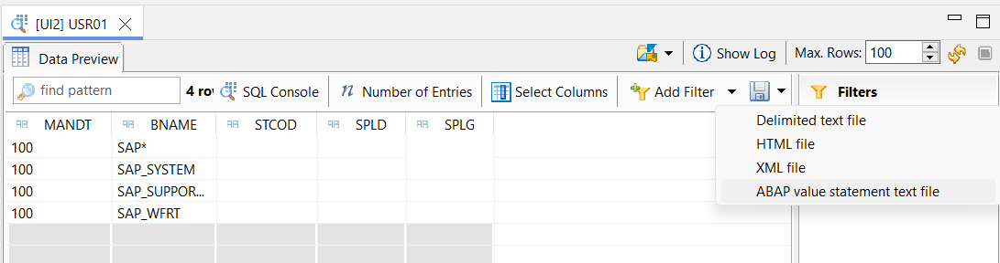

Sometimes you need to take data from the database and replicate it declaratively in ABAP using the VALUE command. For example, to build ABAP Unit tests.

<!--more-->

## In SAPGUI

Nothing can be done in SAPGUI. You forget about it or do it manually: export to CSV and then build the `VALUE()` by hand.

## In Eclipse ADT

Open the Data explorer to see the contents of a table or SQL query. You have two options: with the right button you can convert the entire contents of the table into a `VALUE()` command like this:



Alternatively, you can use the menu at the top right:



And the result is this:

```text
VALUE #(
( MANDT = '100' BNAME = 'SAP*' STCOD = '' SPLD = '' SPLG = '' )
( MANDT = '100' BNAME = 'SAP_SYSTEM' STCOD = '' SPLD = '' SPLG = '' )
( MANDT = '100' BNAME = 'SAP_SUPPORT1' STCOD = '' SPLD = '' SPLG = '' )
( MANDT = '100' BNAME = 'SAP_WFRT' STCOD = '' SPLD = '' SPLG = '' )
)
```

And that's it, just copy+paste this to the ABAP Unit and you're done.

Thank you Aurélien Albert for the tip.

Greetings from Abapinho.
